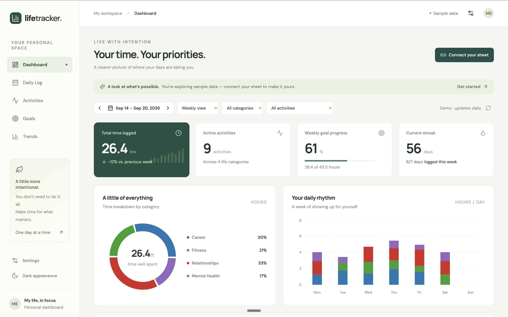
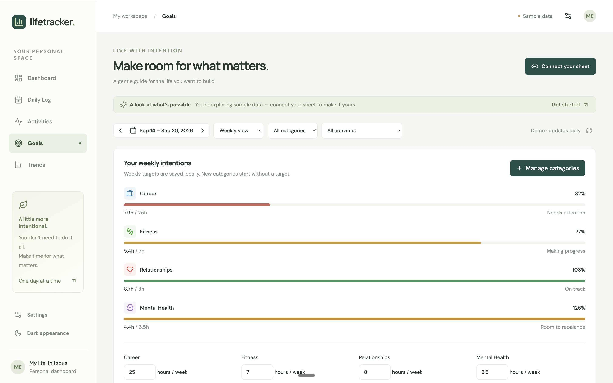
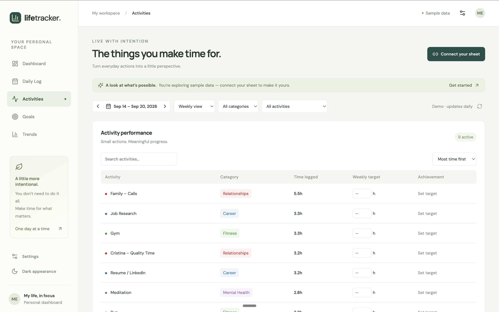
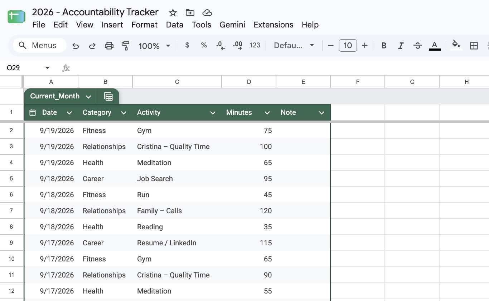
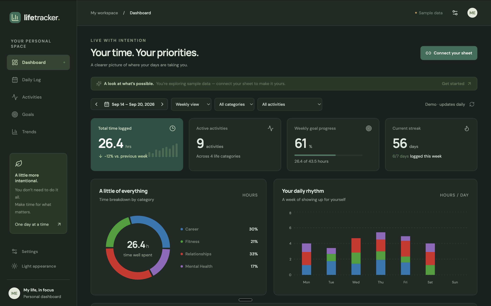
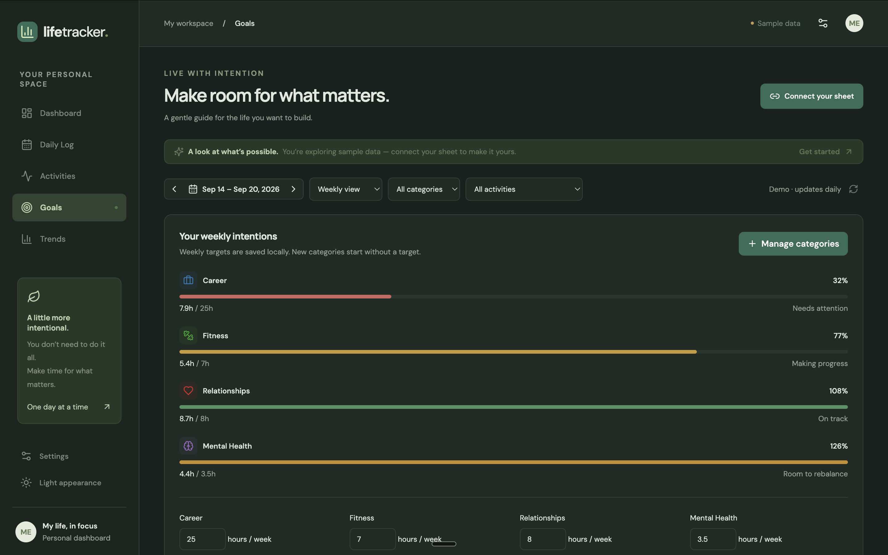
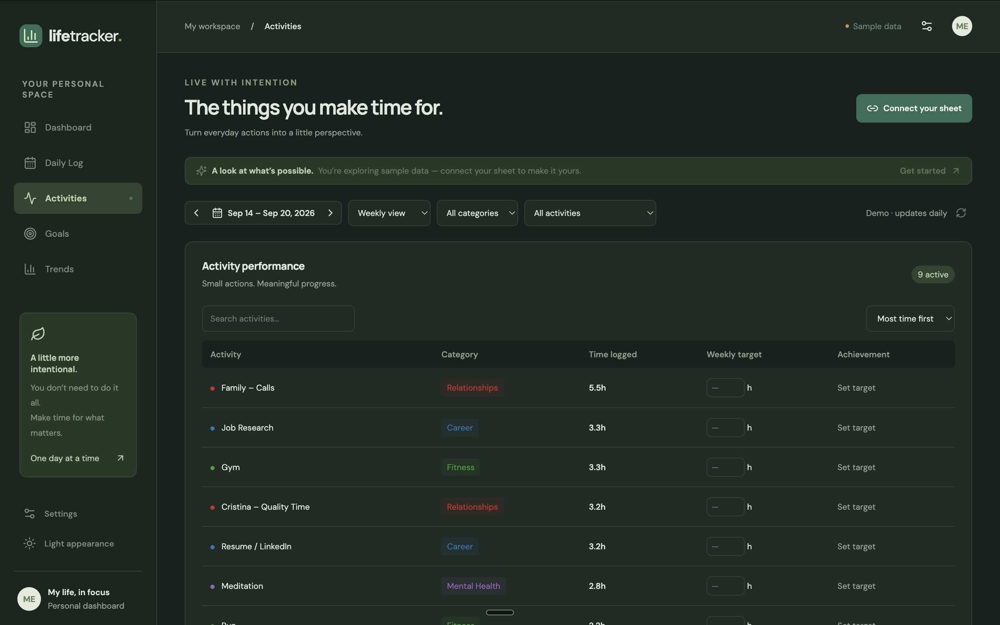

# Life Tracker

A calm, visual dashboard for where your time goes.

I was logging daily activities in a basic spreadsheet so I could review how I spend my days. I wanted that same data in a **web app** that’s easy on the eyes and works on phone and laptop — without retyping everything.

**Life Tracker** does that: keep logging in Google Sheets, open a private dashboard anywhere, and see the week at a glance.

Built by **Brandon Alexander**.

---

## Preview

Sign-in is private — here’s the app with sample data, plus the Google Sheet that feeds it.

### Light version

| Dashboard | Goals |
| --- | --- |
|  |  |

| Activities | Google Sheet |
| --- | --- |
|  |  |

### Dark version

| Dashboard | Goals |
| --- | --- |
|  |  |

| Activities | Google Sheet |
| --- | --- |
|  |  |

---

## What it does

- Pulls your activity log from **Google Sheets** (read-only)
- Shows time by category, goals, streaks, and trends
- Works as a **web app** on desktop and mobile
- **Private sign-in** — only allowlisted Google accounts get in
- Supports **two people, two sheets, one app URL** (each person connects their own spreadsheet after login)

---

## How it was built

1. **Codex** — built the app and iterated on features  
2. **GitHub** — source of truth for the codebase  
3. **Vercel** — hosted the live web app  

Product direction and setup (OAuth, Sheets, deploy) were owned end-to-end; AI coding agents helped ship the implementation fast.

---

## Live demo

Production: [lifetracker-liart.vercel.app](https://lifetracker-liart.vercel.app/)

*(Sign-in is limited to approved accounts — the public landing page shows this preview.)*

---

## Updates

### App initially created — September 18, 2026
- First version of the visual dashboard
- Google Sheets–backed activity views (dashboard, daily log, goals, trends)
- Deployed on Vercel

### Version 1 — September 19, 2026
- Private Google sign-in gate (allowlisted accounts only)
- ~7-day stay-signed-in session on each device
- Each person connects their own Google Sheet after login
- Landing page + README preview gallery with sample data

---

## Stack (short)

Codex + Grok Bot (React · Vite · Recharts · Google Sheets API · Vercel · Google OAuth)

For local setup and env vars, see [`.env.example`](.env.example).
